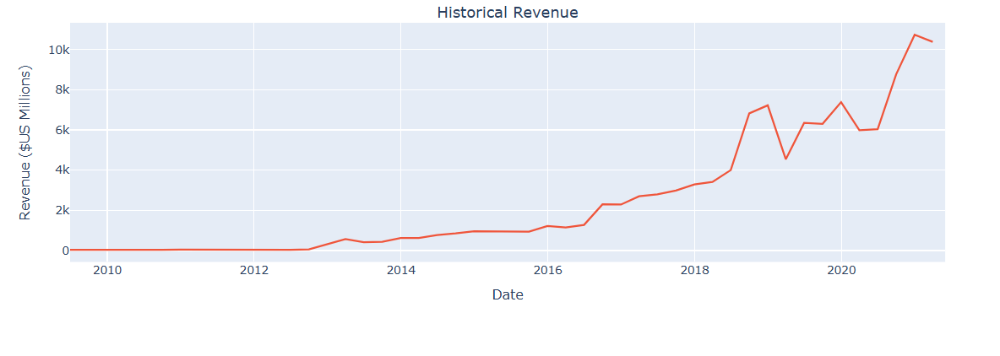
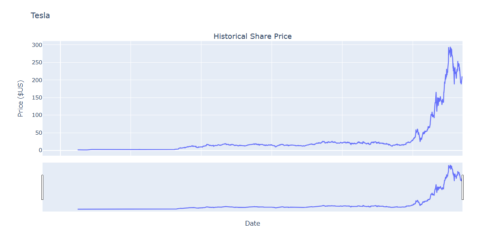
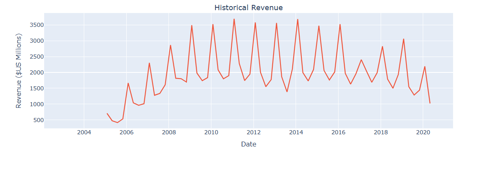
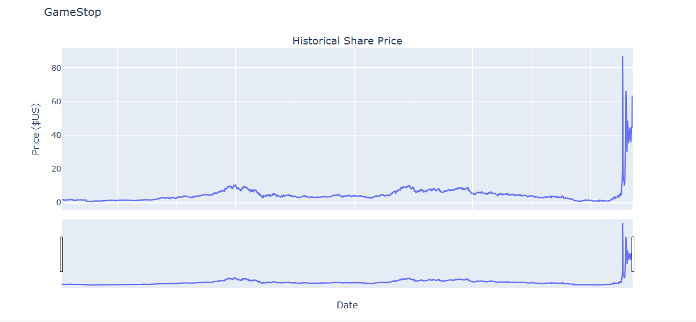
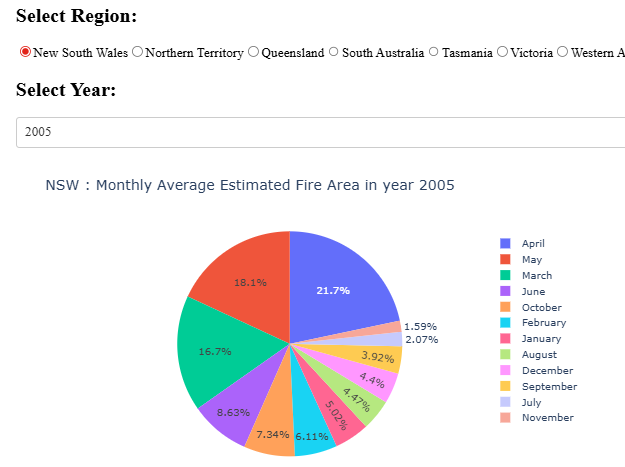
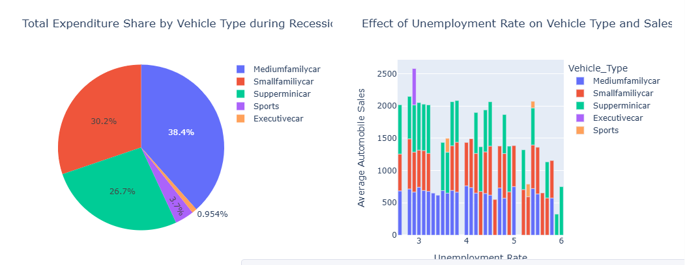
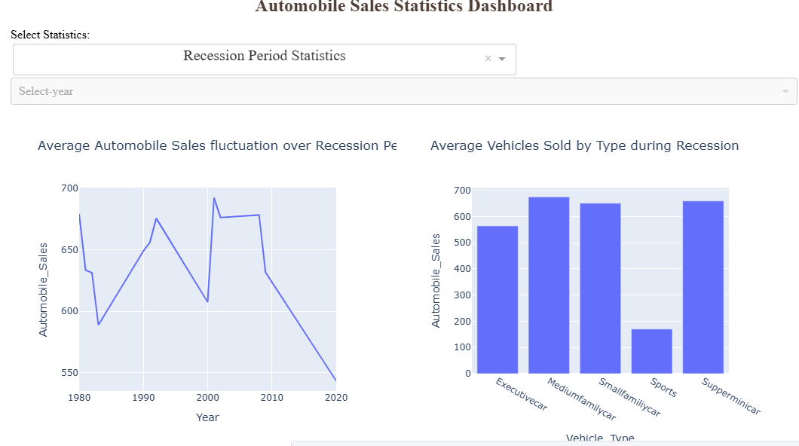
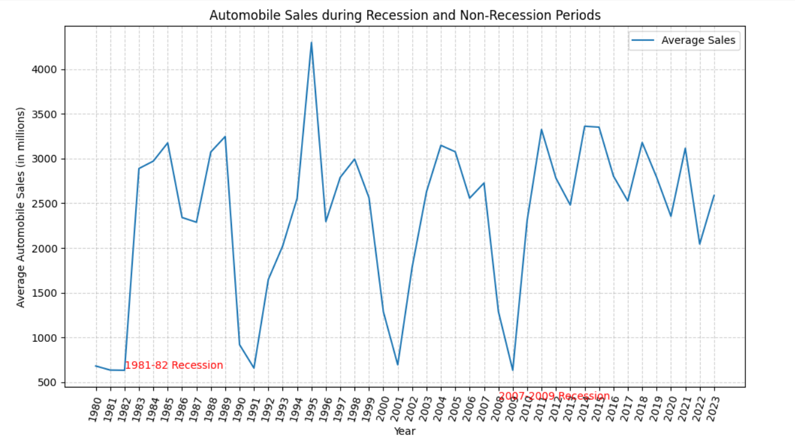
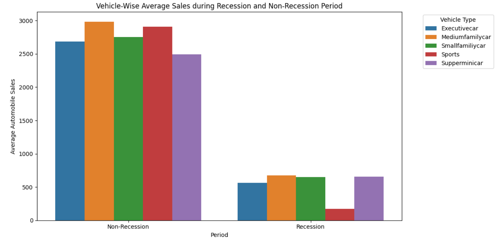
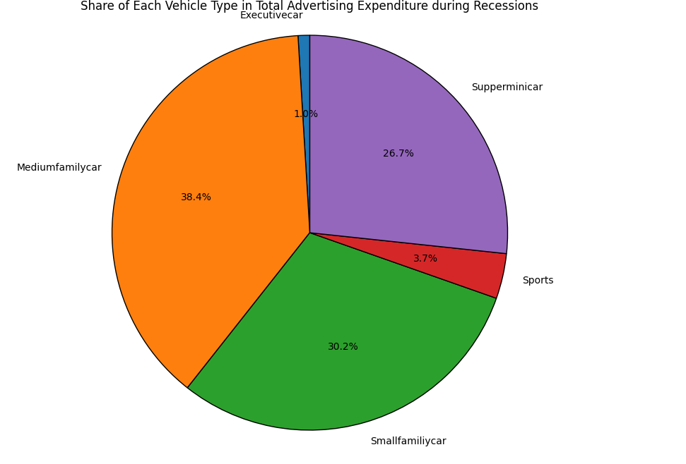

<h1 align="center">📊 Data Analytics Portfolio</h1>

## 01. EXTRACTING AND VISUALISING STOCK DATA

**PROBLEM** - Similar to project no.3

**DATASET** - Stock data from public domains

**TOOLS** - plotly, yfinance, BeautifulSoup, pandas, requests

**PROCESS** - 1. Used Webscraping to extract Tesla revenue data as well as GME revenue data, meanwhile used yfinance library to extract stock data.
2. Used functionalities to plot graph of Tesla stock graph as well as GameStop stock graph to identify trends.

**INSIGHTS** - Share Price and revenue of Tesla follow a similar trend where graph show a definite peak in recent past ( in the last 2 decades ), meanwhile GameStop stock graph shows an indefinite trend where Share Price has increased in the last decade but a substantial dip is being noticed in the revenue graph.

**File** - [view notebook](./Stock_data_extraction.ipynb)

**VISUALISATIONS SCREENSHOTS** -

## 02. HOUSE SALES PREDICTIVE MODELLING (KING COUNTY, WA)

**PROBLEM** - Real estate investors in King County lack a data-driven way to predict property values, leading to potential overpayment or missed opportunities.

**DATASET** - Historical sales data for King County, WA, including 20,000+ records with features like square footage, location, and home grade.

**TOOLS** - Python, pandas, numpy, BeautifulSoup

**PROCESS** - 1. Cleaned missing values and handled outliers in pricing data.
2. Conducted Exploratory Data Analysis (EDA) to find variables with the highest correlation to price.
3. Developed and evaluated a Multiple Linear Regression model.

**INSIGHTS** - Home "grade" and total living area (sqft) are the primary value drivers—each additional grade level correlates with a significant, predictable jump in market value.

**File** - [view notebook](./House_sales_analysis.ipynb)

## 03. AUTOMATED FINANCIAL DATA SCRAPER

**PROBLEM** - Manual tracking of stock market fluctuations is inefficient and prone to human error, hindering real-time decision-making.

**DATASET** - Live-scraped financial data from public market websites.

**TOOLS** - BeautifulSoup, Requests, pandas

**PROCESS** - 1. Built a web scraper to target specific financial tables.
2. Automated the conversion of raw HTML data into structured Pandas DataFrames.
3. Cleaned and formatted numerical data for immediate analysis.

**INSIGHTS** -Successfully automated a data pipeline that captures market data in under 5 seconds, ensuring 100% accuracy compared to manual entry.

**File** - [view notebook](./Financial_data_scrapper.ipynb)

## 04. INTERACTIVE DATA STORYTELLING

**PROBLEM** - Management lacks a centralized, interactive view of regional performance, making it difficult to spot trends over time.

**DATASET** - Multi-year operational data categorized by region and category.

**TOOLS** - Dash by Plotly, pandas

**PROCESS** -1. Defined Key Performance Indicators (KPIs) relevant to business growth.
2. Built a callback-based dashboard allowing users to filter by year and region.
3. Integrated real-time graphing for trend analysis.

**INSIGHTS** - Found that 80% of regional volatility was tied to specific seasonal cycles, allowing for better resource allocation in future quarters.

**File** - [view notebook](./Interactive_dashboard.ipynb)

**DASHBOARD SCREENSHOTS** -

## 05. SALES AND OPERATIONS PERFORMANCE TRACKING

**PROBLEM** - To find answers for questions analysing historical automobile sales data to understand  historical trends in automobile sales during different recession periods.

**DATASET** -  contains historical_automobile_sales data representing automobile sales and related variables during recession and non-recession period.

**TOOLS** - pandas, numpy, matplotlib, seaborn, folium

**PROCESS** - 1. Analysed trends in different years of recession and made appropriate visualisation to highlight the same.
2. Used functionality of seaborn library to create visualisations to compare sales trend per vehicle type for recession period v/s non-recession period.
3. Analysed Advertisement expenditure for each vehicle type during recession period.

**INSIGHTS** - Highest Automobile sales is accounted in the year 1994-95 (non-recession year), conversely, medium family car accounted for the highest share among different vehicle types in Total advertising during recessions.

**File** - [view notebook](./Sales_performance_tracking.ipynb)

**VISUALISATION SCREENSHOTS** - 

## Technical Toolkit ##

**Programming:** Python (Pandas, NumPy, Scikit-Learn)

**Visualization:** Matplotlib, Seaborn, plotly

**Data Extraction:** Web Scraping (BeautifulSoup), SQL basics

**Tools:** GitHub, VS Code, Jupyter Notebooks